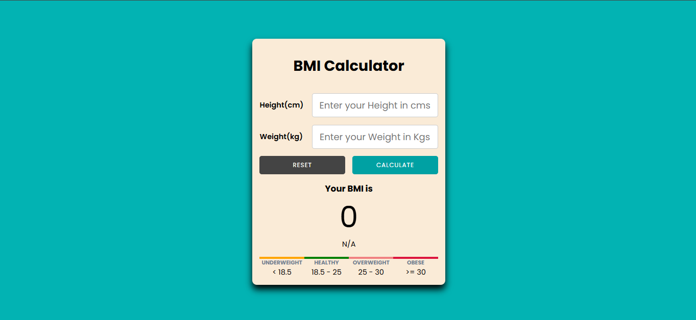

Sure! Here’s a **short and clean version** of your **BMI Calculator README.md** — concise, polished, and perfect for GitHub 👇

---

````markdown
# ⚖️ BMI Calculator

A simple and responsive **BMI Calculator** built using **HTML, CSS, and JavaScript** as part of my **6-month reskilling journey** to strengthen frontend and full-stack skills.

---

## 🖼️ Preview  


---

## 📌 About  
- 🧮 Calculates **Body Mass Index (BMI)** based on height (cm) and weight (kg)  
- 🚦 Displays health category — *Underweight, Healthy, Overweight, or Obese*  
- 🔁 Includes Reset option and input validation  
- 🎨 Clean, responsive, and user-friendly UI  

---

## 🧠 Tech Stack  
- **HTML5** – Structure  
- **CSS3** – Styling  
- **JavaScript (ES6)** – Logic & Interactivity  

---

## ▶️ How to Run  
1. Clone the repo  
   ```bash
   git clone https://github.com/your-username/BMI-Calculator.git
````

2. Open `index.html` in your browser

---

## 💡 Code Core

```js
form.addEventListener("submit", e => {
  e.preventDefault();
  const h = parseFloat(height.value), w = parseFloat(weight.value);
  if (!h || !w) return desc.textContent = "Enter valid inputs";
  const bmi = (w / ((h ** 2) / 10000)).toFixed(2);
  bmiText.textContent = bmi;
  desc.innerHTML = `You are <strong>${
    bmi < 18.5 ? "underweight" : bmi < 25 ? "healthy" : bmi < 30 ? "overweight" : "obese"
  }</strong>`;
});
```

---

✨ *Part of my continuous journey to master Frontend → Full Stack → DevOps.*

```

